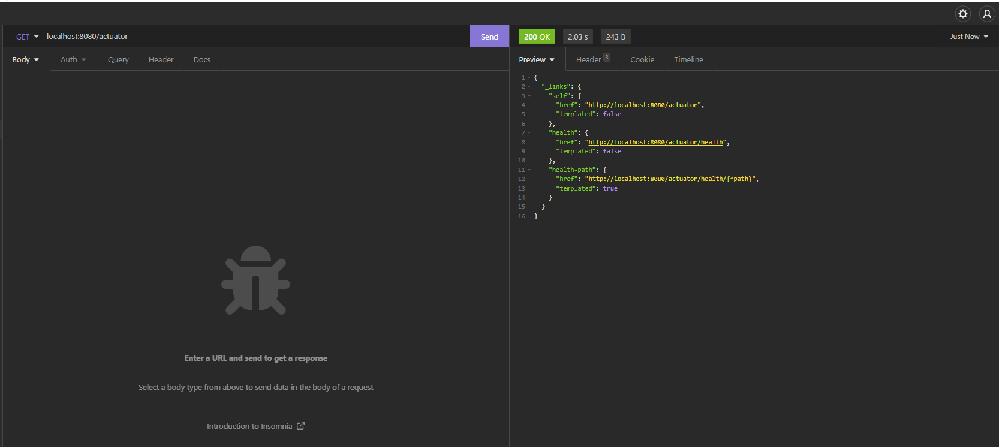
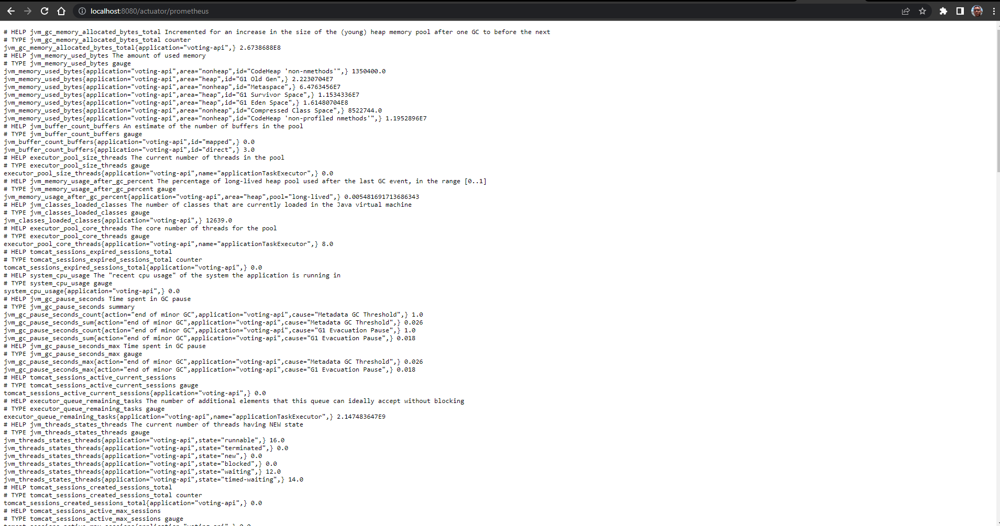
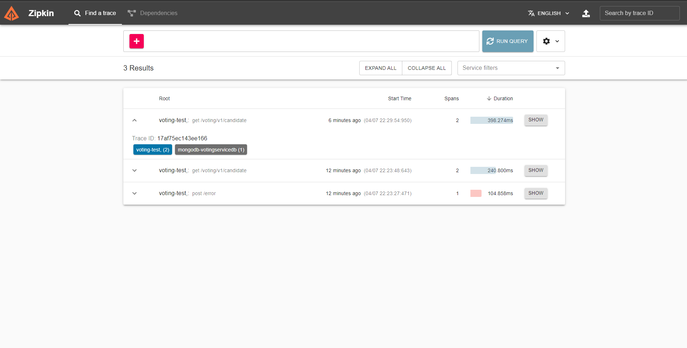

# Voting API
Permitir que os usuários votem em seu candidato e vejam o candidato mais votado.

## Members

Leonardo Faria dos Santos

Nidio dos Santos Dolfini

Cristiano Brito de Andrade

Alan Delon Lazaro Silva Junqueira

## Tasks

### Terraform
- [Infrastructure as code - iac](https://github.com/leonardofaria00/voting-api/tree/iac-voting-api)

### Build Pipeline
- [CI/CD Voting API](https://gitlab.com/nidiosdolfini/teste)

### GET Candidate

### Actuator

### Prometheus

### Papertrail
doning

### Zipkin

