# Microservice Voting API Spring Rest

Permitir que os eleitores votem em seu candidato e veja o candidato mais votado.

## Members

Leonardo Faria dos Santos

Nidio dos Santos Dolfini

Cristiano Brito de Andrade

Alan Delon Lazaro Silva Junqueira

## Tasks

### GET Candidate

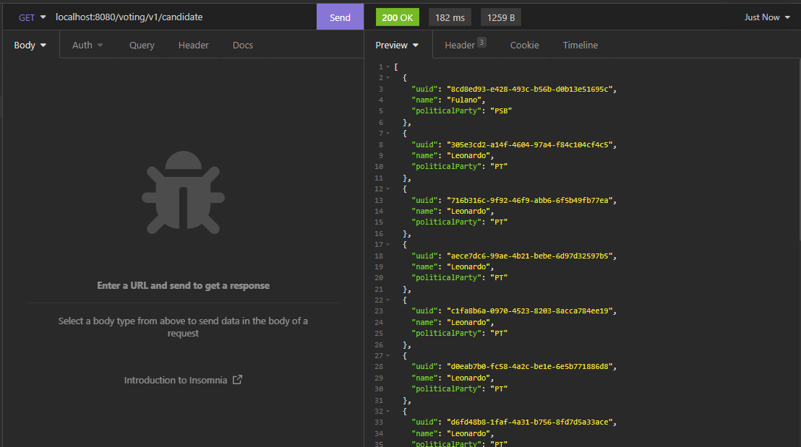

### POST Candidate

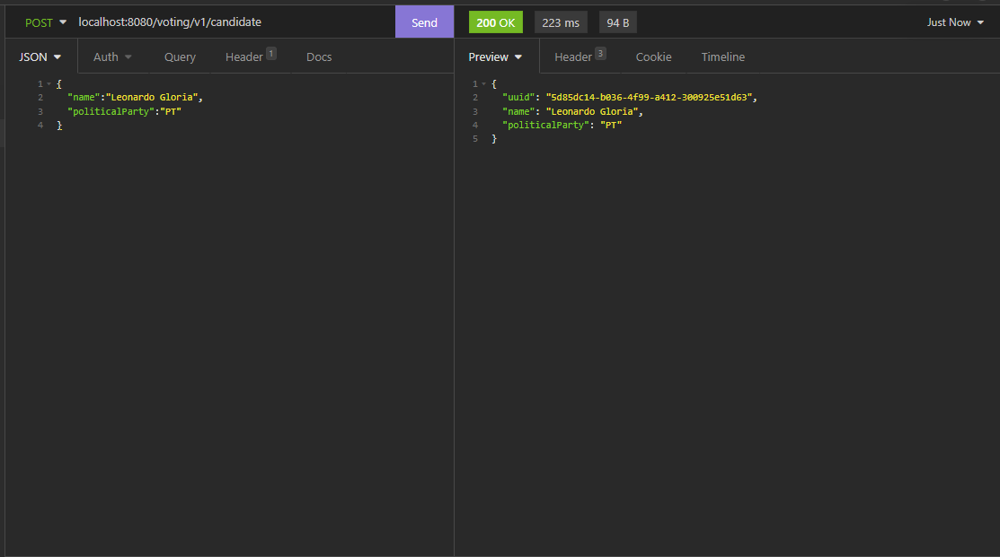

### PUT Candidate

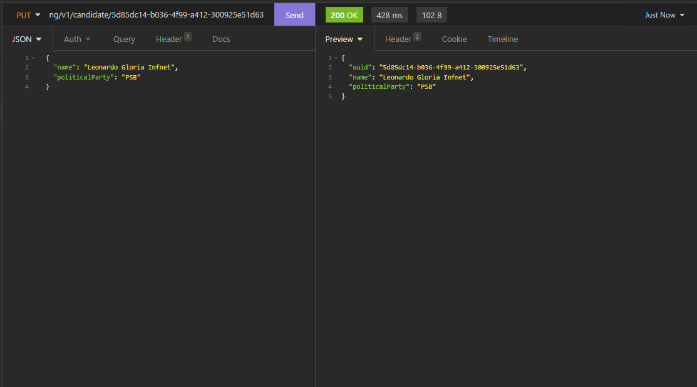

### Collection Candidate

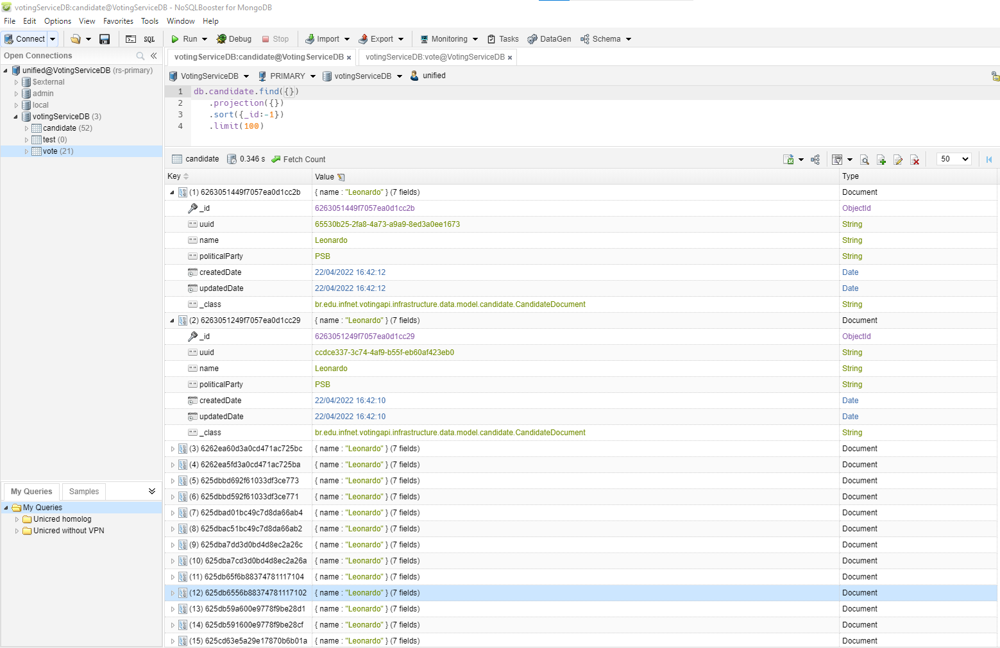

### Collection Vote

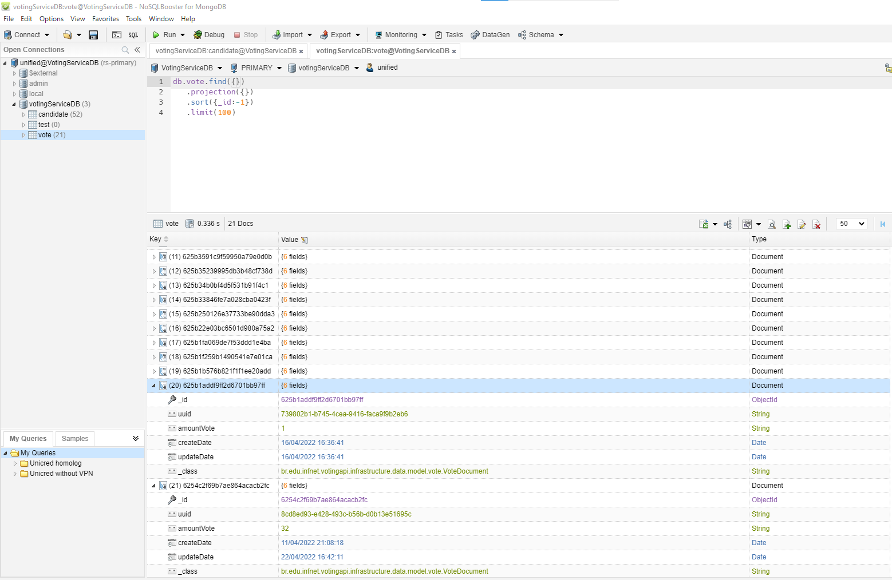

### Actuator

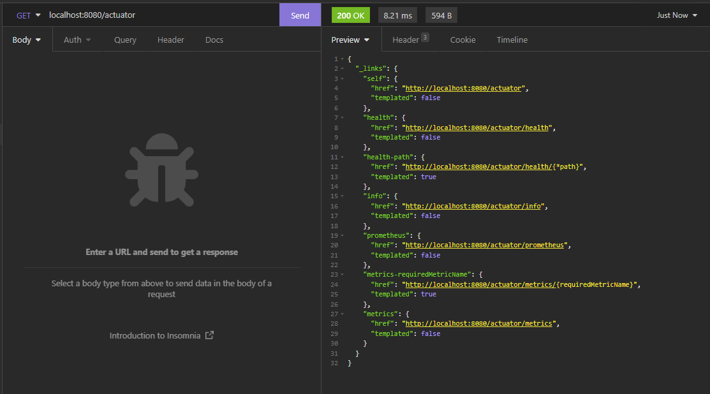

### Prometheus

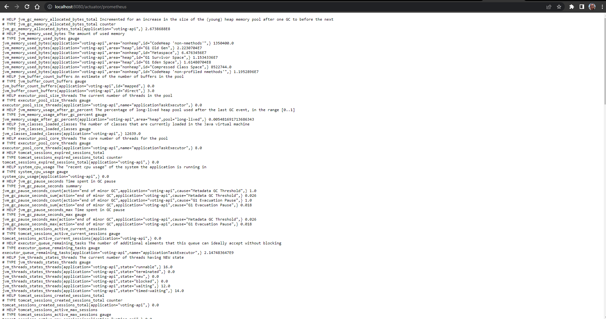
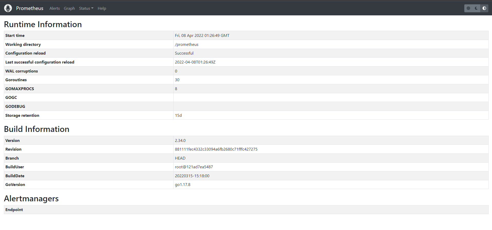

### Papertrail

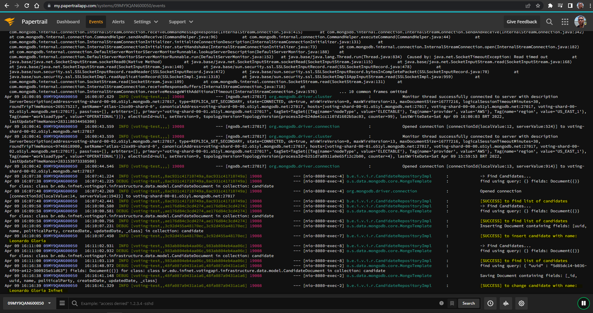

### Zipkin

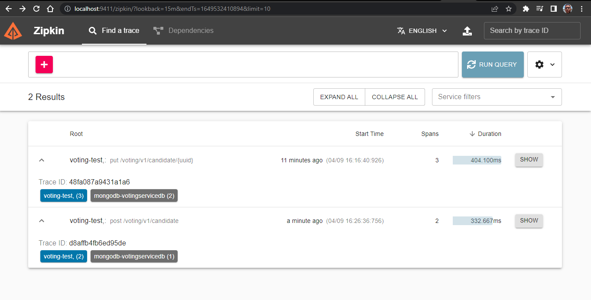
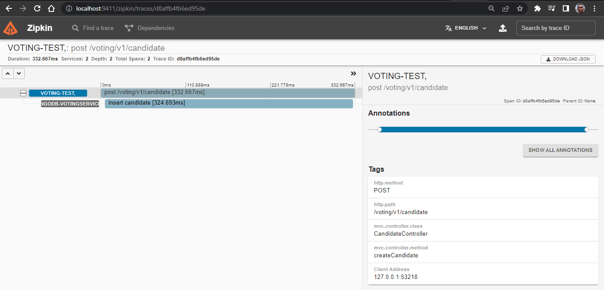

### Terraform

- [Infrastructure as code - iac](https://github.com/leonardofaria00/voting-api/tree/iac-voting-api)

  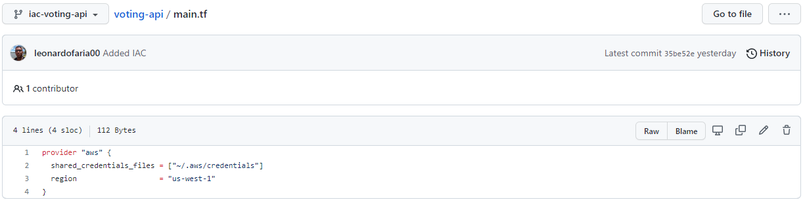
  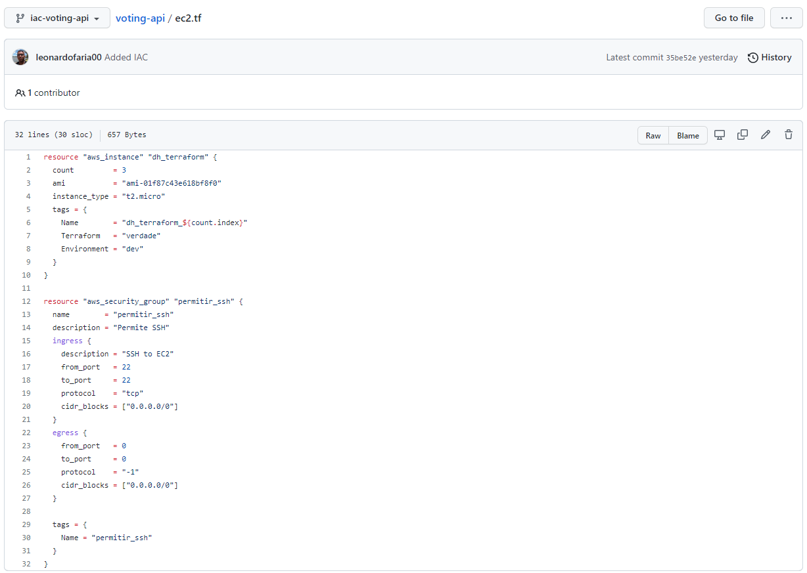
  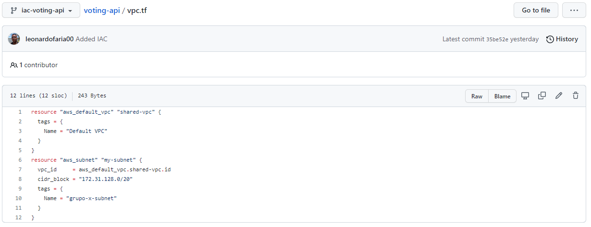

### Build Pipeline

- [CI/CD Voting API](https://gitlab.com/nidiosdolfini/teste)

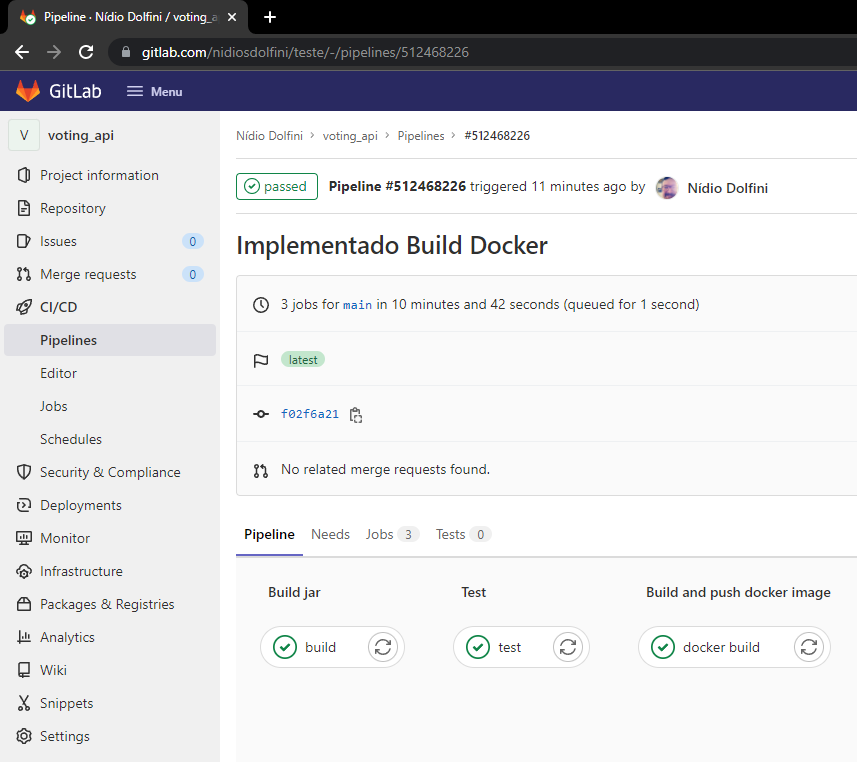

### Build Pipeline Finished

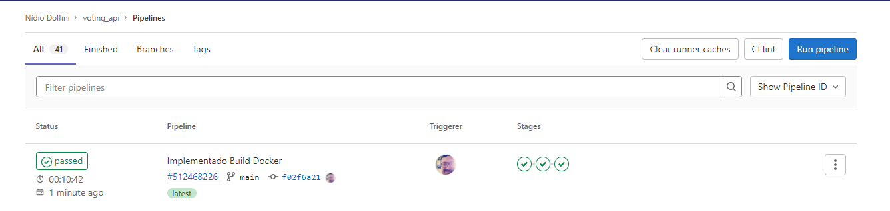
